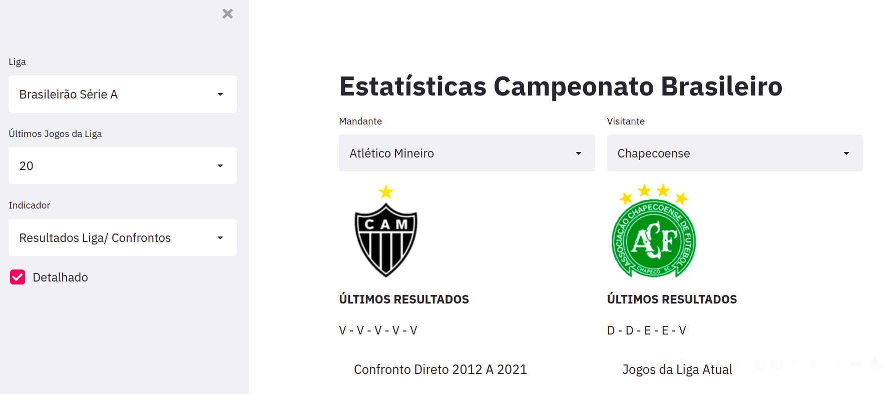

# Estatisticas de Futebol

Web App: <a href="https://share.streamlit.io/marcosrmg/estatisticas-de-futebol/main/src/app.py" target="_blank">Estatísticas do Campeonato Brasileiro</a>

O Web App utiliza o Streamlit como solução de front-end, o objetivo é visualizar dados estatísticos de clubes de futebol, as informações foram coletadas no site https://fbref.com/pt/.

## Arquitetura

## Arquitetura

Obs: Os arquivos .py estão disponíveis na pasta src

O objetivo é o de visualizar as propabilidades para o número de gols para a partida e qual o resultado mais provável do confronto entre duas equipes. 
